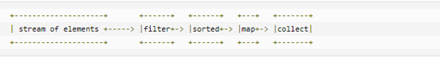

## Java8新特性

Java8是Java语言开发的一个主要版本，Oracle公司与2014年发布Java8，它支持函数式编程，新的JavaScript引擎，新的日期API，新的Stream API等

> 官方文档：https://docs.oracle.com/javase/8/docs/api/

### 1.Lambda表达式

Lambda 允许把函数作为一个方法的参数（函数作为参数传递进方法中），语法包含参数与方法体，方法体只有一条不用写return;

```
(parameters) -> expression 或 (parameters) ->{ statements; }
```

Lambda表达式的简单例子：

```
//1.不需要参数，返回值为5
() -> 5

//2.接收一个参数（数字类型），返回其2倍的值
x -> 2 * x

//3.接收两个参数（数字），并返回他们的差值
(x, y) -> x - y

//4.接收两个int型整数，返回他们的和
(int x, int y) -> x + y

//5.接受一个String对象，并在控制台打印，不返回任何值（看起来像是返回void)
(String s) -> System.out.print(s)
```


### 2.方法引用

方法引用提供了非常有用的语法，可以直接引用已有Java类或对象的方法或构造器。与Lambda联合使用，方法引用可以使语言的构造更紧凑简洁，减少冗余代码。

Car类是不同方法引用的例子

```
public static class Car{
  public static Car create(final Supplier<Car> supplier){
    return supplier.get();
  }
  
  public static void collide(final Car car){
    System.out.println("Collided" + car.toString());
  }
  
  public void follow(final Car another){
    System.out.println("Following the" + another.toString());
  }
  
  public void repair(){
    System.out.println("Repaired" + this.toString());
  }
}
```

1. 构造器引用

   语法是Class::new，或者更一般的Class< T >::new，要求构造器方法是没有参数；Java编译器会自动根据Factory.create方法的签名来选择函数。

   ```
   final Car car = Car.create( Car::new ); //相当于new了一个car
   final List< Car > cars = Arrays.asList( car );
   ```

2. 静态方法引用

   它的语法是Class::**static**_method，实例如下：

   ```
   cars.forEach( Car::collide );
   ```

3. 特定类的任意对象的方法引用

   它的语法是Class::method实例如下：

   ```
   cars.forEach( Car::repair );
   ```

4. 特定对象的方法引用

   它的语法是instance::method实例如下：

   ```
   final Car police = Car.create( Car::new );
   cars.forEach( police::follow );
   ```

#### 方法引用实例

```
import java.util.List;
import java.util.ArrayList;
 
public class Java8Tester {
   public static void main(String args[]){
      List<String> names = new ArrayList();
        
      names.add("Google");
      names.add("Runoob");
      names.add("Taobao");
      names.add("Baidu");
      names.add("Sina");
        
      names.forEach(System.out::println);
   }
}
```

实例中我们将 System.out::println 方法作为静态方法来引用。

执行以上脚本，输出结果为：

```
$ javac Java8Tester.java 
$ java Java8Tester
Google
Runoob
Taobao
Baidu
Sina
```


### 3.函数式接口

函数式接口就是**只有一个方法**的普通接口。java.lang.Runnable \concurrent.Callable是函数式接口最典型的例子。采用@FunctionalInterface注解 ，函数式接口可被隐式转换为lambda 表达式。

如定义了一个函数式接口如下：

```
@FunctionalInterface
interface GreetingService {
 void sayMessage(String message);
}
```

那么就可以使用Lambda表达式来表示该接口的一个实现(注：JAVA 8 之前一般是用匿名类实现的)：

```
GreetingService greetService1 = message -> System.out.println("Hello " + message);
```

### 4.默认方法

Java8新增了接口的默认方法

简单说，默认方法就是接口可以有实现方法，而且不需要实现类去实现其方法

我们只需在方法名前面加个default关键字即可实现默认方法

> 为什么要有这个特性？
>
> 首先，之前的接口是个双刃剑，好处是面向抽象而不是面向具体编程，缺陷是，当需要修改接口的时候，需要修改全部实现该接口的类，目前的Java8之前的集合框架没有forEach方法，通常能想到的解决办法是在JDK里给相关的接口添加新的方法及实现，然后，对于已经发布的版本，是没法在接口添加新方法的同时不影响已有的实现，所以引进的默认方法，他们的目的是为了解决接口的修改与现有的实现不兼容的问题。

#### 语法

默认方法语法格式如下：

```
public interface Vehicle{
  default void print(){
    System.out.println("我是一辆车")
  }
}
```

#### 多个默认方法

一个接口有默认方法，考虑这样的情况，一个类实现了多个接口，且这些接口有相同的默认方法，以下实例说明了这种情况的解决方法

```
public interface Vehicle{
  default void print(){
    System.out.println("我是一辆车")
  }
}

public interface FourWheeler(){
  default void print(){
    Syrtem.out.println("我是一辆四轮车")
  }
}
```

第一种解决方案是创建自己的默认方法，来覆盖重写接口的默认方法

```
public class Car implements Vehicle,FourWheeler{
  default void print(){
    System.out.println("我是一辆四轮汽车")
  }
}
```

第二种解决方案可以使用super来调用指定接口的默认方法

```
public class Car implements Vehicle, FourWheeler {
   public void print(){
      Vehicle.super.print();
   }
}
```

#### 静态默认方法

Java 8 的另一个特性是接口可以声明（并且可以提供实现）静态方法。例如：

```
public interface Vehicle {
   default void print(){
      System.out.println("我是一辆车!");
   }
    // 静态方法
   static void blowHorn(){
      System.out.println("按喇叭!!!");
   }
}
```

#### 默认方法实例

```
public class Java8Tester {
   public static void main(String args[]){
      Vehicle vehicle = new Car();
      vehicle.print();
   }
}
 
interface Vehicle {
   default void print(){
      System.out.println("我是一辆车!");
   }
    
   static void blowHorn(){
      System.out.println("按喇叭!!!");
   }
}
 
interface FourWheeler {
   default void print(){
      System.out.println("我是一辆四轮车!");
   }
}
 
class Car implements Vehicle, FourWheeler {
   public void print(){
      Vehicle.super.print();
      FourWheeler.super.print();
      Vehicle.blowHorn();
      System.out.println("我是一辆汽车!");
   }
}
```

输出结果为：

```
$ javac Java8Tester.java 
$ java Java8Tester
我是一辆车!
我是一辆四轮车!
按喇叭!!!
我是一辆汽车!
```


### 5.Optional类

Java应用中最常见的bug就是空指针异常，在Java8之前，Google Guava引入了Optionals类来解决NullPointerException，从而避免源码被各种null检查污染，以便开发者写出更加整洁的代码，Java8也将Optional加入了官方库。

Optional类解决空指针异常，如果值存在则isPresent()方法会返回true，调用get()方法会返回该对象

```
Optional<String> fullName = Optional.ofNullable(null);
System.out.println( "Full Name is set? " + fullName.isPresent() );        
System.out.println( "Full Name: " + fullName.orElseGet( () -> "[none]" ) ); 
System.out.println( fullName.map( s -> "Hey " + s + "!" ).orElse( "Hey Stranger!" ) );
```

如果Optional实例持有一个非空值，则**isPresent()**方法返回true，否则返回false

**orElseGet()**方法，Optional实例持有null，则可以接收一个Lambda表达式生成的默认值

**map()**方法可以将现有的Optional实例的值转换成新的值

**orElse()**方法与orElseGet()方法类似，但是在持有null的时候返回传入的默认值

上述代码的输出结果如下：

```
Full Name is set? flase
Full Name: [none]
Hey Stranger!
```

再看下另一个简单的例子：

```
Optional< String > firstName = Optional.of( "Tom" );
System.out.println( "First Name is set? " + firstName.isPresent() );        
System.out.println( "First Name: " + firstName.orElseGet( () -> "[none]" ) ); 
System.out.println( firstName.map( s -> "Hey " + s + "!" ).orElse( "Hey Stranger!" ) );
System.out.println();
```

这个例子的输出是：

```sql
First Name is set? true
First Name: Tom
Hey Tom!
```

### 6.Nashorn JavaScript引擎

Nashorn JavaScript Engine在Java15已经不可用了。

这在Java11标记为：

```
@deprecated(forRemoval = true)
```

从JDK1.8开始，Nashorn取代Rhino（JDK1.6，JDK1.7）成为Java的嵌入式JavaScript引擎。

#### jjs

jjs是一个基于Nashorn引擎的命令行工具，它接受一些JavaScript源代码为参数，并且执行这些源代码

例如，我们创建一个具有如下内容的sample.js文件：

```
print("Hello World!")
```

打开控制台，输入以下命令：

```
$ jjs sample.js
```

以上程序输出结果为：

```
Hello World!
```

#### jjs交互式编程

打开控制台，输入以下命令

```
$ jjs
jjs> print("Hello, World!")
Hello, World!
jjs> quit()
>>
```

#### 传递参数

```
$ jjs -- a b c
jjs> print('字母: ' +arguments.join(", "))
字母: a, b, c
jjs> 
```

#### Java中调用JavaScript

使用 ScriptEngineManager, JavaScript 代码可以在 Java 中执行，实例如下：

```
import javax.script.ScriptEngineManager;
import javax.script.ScriptEngine;
import javax.script.ScriptException;
 
public class Java8Tester {
   public static void main(String args[]){
   
      ScriptEngineManager scriptEngineManager = new ScriptEngineManager();
      ScriptEngine nashorn = scriptEngineManager.getEngineByName("nashorn");
        
      String name = "Runoob";
      Integer result = null;
      
      try {
         nashorn.eval("print('" + name + "')");
         result = (Integer) nashorn.eval("10 + 2");
         
      }catch(ScriptException e){
         System.out.println("执行脚本错误: "+ e.getMessage());
      }
      
      System.out.println(result.toString());
   }
}
```

执行以上脚本，输出结果为：

```
$ javac Java8Tester.java 
$ java Java8Tester
Runoob
12
```

#### JavaScript中调用Java

```
var BigDecimal = Java.type('java.math.BigDecimal');

function calculate(amount, percentage) {

   var result = new BigDecimal(amount).multiply(
   new BigDecimal(percentage)).divide(new BigDecimal("100"), 2, BigDecimal.ROUND_HALF_EVEN);
   
   return result.toPlainString();
}

var result = calculate(568000000000000000023,13.9);
print(result);
```

我们使用 jjs 命令执行以上脚本，输出结果如下：

```
$ jjs sample.js
78952000000000002017.94
```

### 7.Stream

Java8 API添加了一个新的抽象成为流Stream，Stream使用一种类似用SQL语句从数据库查询数据的直观方式来提供一种对Java集合运算和表达的高阶抽象

这种风格将要处理的元素集合看做一种流，流在管道中传输，并且可以在管道的节点上进行处理，比如筛选、排序、聚合等。

四大管道技术：



1. 创建流

   - stream() - 为集合创建串行流
   - parallelStream() - 为集合创建并行流

   ```
   List<String> strings = Arrays.asList("abc", "", "bc", "efg", "abcd","", "jkl"); 
   List<String> filtered = strings.stream().filter(string -> !string.isEmpty()).collect(Collectors.toList());
   ```

2. forEach

   Stream提供了新的方法forEach来迭代流中的每个数据，以下代码片段使用forEach输出了10个随机数

   ```
   Random random = new Random();
   random.ints().limit(10).forEach(System.out::println);
   ```

3. map

   map方法用于映射到每个元素到对应的结果，以下代码片段使用map输出了元素对应的平方数

   ```
   List<Integer> numbers = Arrays.asList(3, 2, 2, 3, 7, 3, 5);
   List<integer> squaresList = numbers.stream().map(i -> i*i).distinct().collect(Collectors.toList);
   ```

4. filter

   filter方法用于通过设置的条件过滤出元素，以下代码片段使用filter方法过滤出空字符串

   ```
   List<String>strings = Arrays.asList("abc", "", "bc", "efg", "abcd","", "jkl"); 
   // 获取空字符串的数量 
   int count = strings.stream().filter(string -> string.isEmpty()).count();
   ```

5. limit

   limit方法用于获取指定数量的流，以下代码使用limit方法打印出10条数据

   ```
   Random random = new Random();
   random.ints().limit(10).forEach(System.out::println);
   ```

6. sorted

   sorted方法用于对流进行排序，以下代码片段使用sorted方法对输出的10个随机数进行排序

   ```
   Random random = new Random();
   random.ints().limit(10).sorted().forEach(System.out::println);
   ```

7. 并行（parallel）程序

   parallelStream是流并行处理程序的代替写法，以下实例我们使用parallelStream来输出空字符串的数量

   ```
   List<String> strings = Arrays.asList("abc", "", "bc", "efg", "abcd", "", "jkl");
   int count = strings.parallelStream().filter(string -> string.isEmpty()).count();
   ```

   我们可以很容易的在顺序运行和并行直接切换

8. Collectors

   Collectors类实现了很多规约操作，例如将流转换成集合和聚合元素，Collectors可用于返回列表或字符串

   ```
   List<String>strings = Arrays.asList("abc", "", "bc", "efg", "abcd","", "jkl");
   List<String> filtered = strings.stream().filter(string ->!string.isEmpty()).collect(Collectors.toList()); 
   System.out.println("筛选列表: " + filtered); 
   
   String mergedString = strings.stream().filter(string -> !string.isEmpty()).collect(Collectors.joining(", ")); 
   System.out.println("合并字符串: " + mergedString);
   ```

9. 统计summaryStatistics

   另外，一些产生统计结果的收集器也非常有用。它们主要用于int、double、long等基本类型上，它们可以用来产生类似如下的统计结果。

   ```text
   List<Integer> numbers = Arrays.asList(3, 2, 2, 3, 7, 3, 5); 
   
   IntSummaryStatistics stats = numbers.stream().mapToInt((x) -> x).summaryStatistics(); System.out.println("列表中最大的数 : " + stats.getMax()); 
   System.out.println("列表中最小的数 : " + stats.getMin());
   System.out.println("所有数之和 : " + stats.getSum()); 
   System.out.println("平均数 : " + stats.getAverage());
   ```

### 8.Date/Time API(JSR 310)

Java8通过发布新的Date-Time API来进一步加强对日期与时间的处理

旧版的Java中，日期时间API存在诸多问题，其中有：

- **非线程安全** - java.util.Date是非线程安全的，所有的日期类都是可变的，这是Java日期类最大的问题之一
- **设计很差** - Java的日期/时间类的定义并不一致，在java.util和java.sql的包中都有日期类，此外用于格式化和解析的类在java.text包中定义。java.util.Date同时包含日期和时间，而java.sql.Date仅包含日期，将其纳入java.sql包并不合理。另外这两个类都有相同的名字，这本身就是一个非常糟糕的设计
- **时区处理很麻烦** - 日期类并不提供国际化，没有时区支持，因此Java引入了java.util.Calendar和java.util.TimeZone类，但他们同样存在上述所有的问题

新版Java8在java.time包下提供了很多新的API，以下为两个比较重要的API

- Local(本地) - 简化了日期时间的处理，没有时区的问题
- Zoned(时区) - 通过制定的时区处理日期时间

新的java.time包含了所有处理日期、时间、日期/时间、时区、时刻（instants）、过程（during）与时钟（clock）的操作

```
LocalDate，LocalTime，LocalDateTime    - 时间
Instant - 时间戳（以Unix元年：1970年1月1日 00:00:00到某个时间的毫秒值）
Duration - 计算两个时间之间的间隔
Period - 计算两个日期之间的间隔
TemporalAdjust - 时间校正器
DateTimeFormatter - 格式化时间/日期
ZonedDate，ZonedTime，ZonedDateTime - 时区
```

本地化日期API

```
public class Java8Tester{
  public static void main(String args[]){
    Java8Tester java8tester = new Java8Tester();
    java8tester.testLocalDateTime();
  }
  
  public void testLocalDateTime(){
    //获取当前的日期时间
    LocalDateTime currentTime = LocalDateTime.now();
    System.out.println("当前时间：" + currentTime);
    
    LocalDate date1 = currentTime.toLocalDate();
    System.out.println("date1: " + date1);
    
    Month month = currentTime.getMonth();
    int day = currentTime.getDayOfMonth();
    int seconds = currentTime.getSecond();
    
    System.out.println("月: " + month +", 日: " + day +", 秒: " + seconds);
    
    LocalDateTime date2 = currentTime.withDayOfMonth(10).withYear(2012);
    System.out.println("date2: " + date2);
    
    // 12 december 2014
    LocalDate date3 = LocalDate.of(2014, Month.DECEMBER, 12);
    System.out.println("date3: " + date3);
        
    // 22 小时 15 分钟
    LocalTime date4 = LocalTime.of(22, 15);
    System.out.println("date4: " + date4);
        
    // 解析字符串
    LocalTime date5 = LocalTime.parse("20:15:30");
    System.out.println("date5: " + date5);
    
  }
}
```

输出结果为：

```
$ javac Java8Tester.java 
$ java Java8Tester
当前时间: 2016-04-15T16:55:48.668
date1: 2016-04-15
月: APRIL, 日: 15, 秒: 48
date2: 2012-04-10T16:55:48.668
date3: 2014-12-12
date4: 22:15
date5: 20:15:30
```

使用时区的日期时间API

```
import java.time.ZonedDateTime;
import java.time.ZoneId;
 
public class Java8Tester {
   public static void main(String args[]){
      Java8Tester java8tester = new Java8Tester();
      java8tester.testZonedDateTime();
   }
    
   public void testZonedDateTime(){
    
      // 获取当前时间日期
      ZonedDateTime date1 = ZonedDateTime.parse("2015-12-03T10:15:30+05:30[Asia/Shanghai]");
      System.out.println("date1: " + date1);
        
      ZoneId id = ZoneId.of("Europe/Paris");
      System.out.println("ZoneId: " + id);
        
      ZoneId currentZone = ZoneId.systemDefault();
      System.out.println("当期时区: " + currentZone);
   }
}
```

输出结果为:

```
$ javac Java8Tester.java 
$ java Java8Tester
date1: 2015-12-03T10:15:30+08:00[Asia/Shanghai]
ZoneId: Europe/Paris
当期时区: Asia/Shanghai
```


### 9.Base64

对Base64编码的支持已经被加入到Java8官方库中，这样不需要使用第三方库就可以进行Base64编码

内嵌类：

- static class Base64.Decoder

  该类实现一个解码器用于 使用Base64编码来解码字节数据

- static class Base64.Encoder

  该类实现一个编码器，使用Base64编码来编码字节数据

> Base64类的很多方法从java.lang.Object继承

例子代码如下：

```
package com.javacodegeeks.java8.base64;
 
import java.nio.charset.StandardCharsets;
import java.util.Base64;
 
public class Base64s {
    public static void main(String[] args) {
        final String text = "Base64 finally in Java 8!";
 
        final String encoded = Base64
            .getEncoder()
            .encodeToString( text.getBytes( StandardCharsets.UTF_8 ) );
        System.out.println( encoded );
 
        final String decoded = new String( 
            Base64.getDecoder().decode( encoded ),
            StandardCharsets.UTF_8 );
        System.out.println( decoded );
    }
}
```

这个例子的输出结果如下：

```
QmFzZTY0IGZpbmFsbHkgaW4gSmF2YSA4IQ==
Base64 finally in Java 8!
```

新的Base64 API也支持URL和MINE的编码解码

### 10.重复注解

自从Java5引入注解依赖，这个特性开始变得非常流行，并在各个框架和项目中被广泛使用，不过，注解有个很大的限制是：在同一个地方不能多次使用用一个注解，Java8打破了这个限制，引入了重复注解的概念，允许在同一个地方多次使用同一个注解。

在Java8中使用@Repeatable注解定义重复注解，实际上，这并不是语言层面的改进，而是编译器做的一个trick，底层的技术仍然相同，可以利用下面的代码说明：

```
package com.javacodegeeks.java8.repeatable.annotations;
 
import java.lang.annotation.ElementType;
import java.lang.annotation.Repeatable;
import java.lang.annotation.Retention;
import java.lang.annotation.RetentionPolicy;
import java.lang.annotation.Target;
 
public class RepeatingAnnotations {
    @Target( ElementType.TYPE )
    @Retention( RetentionPolicy.RUNTIME )
    public @interface Filters {
        Filter[] value();
    }
 
    @Target( ElementType.TYPE )
    @Retention( RetentionPolicy.RUNTIME )
    @Repeatable( Filters.class )
    public @interface Filter {
        String value();
    };
 
    @Filter( "filter1" )
    @Filter( "filter2" )
    public interface Filterable {        
    }
 
    public static void main(String[] args) {
        for( Filter filter: Filterable.class.getAnnotationsByType( Filter.class ) ) {
            System.out.println( filter.value() );
        }
    }
}
```

正如我们所见，这里的**Filter**类使用@Repeatable(Filters.class)注解修饰，而**Filters**是存放**Filter**注解的容器，编译器尽量对开发者屏蔽这些细节。这样，**Filterable**接口可以用两个**Filter**注解注释（这里并没有提到任何关于Filters的信息）。

另外，反射API提供了一个新的方法：**getAnnotationsByType()**，可以返回某个类型的重复注解，例如`Filterable.class.getAnnoation(Filters.class)`将返回两个Filter实例，输出到控制台的内容如下所示：

```
filter1
filter2
```

### 11.更好的类型推断

Java8编译器在类型推断方面有很大的提升，在很多场景下编译器可以推导出某个参数的数据类型，从而使得代码更为简洁，例子代码如下：

```
package com.javacodegeeks.java8.type.inference;
 
public class Value< T > {
    public static< T > T defaultValue() { 
        return null; 
    }
 
    public T getOrDefault( T value, T defaultValue ) {
        return ( value != null ) ? value : defaultValue;
    }
}
```

下列代码是**Value<String>**类型的应用：

```
package com.javacodegeeks.java8.type.inference;

public class TypeInference {
    public static void main(String[] args) {
        final Value< String > value = new Value<>();
        value.getOrDefault( "22", Value.defaultValue() );
    }
}
```

参数**Value.defaultValue()**的类型由编译器推导得出，不需要显式指明。在Java 7中这段代码会有编译错误，除非使用`Value.<String>defaultValue()`。

### 12.工具

#### 类依赖分析器：jdeps

jdeps是一个相当棒的命令行工具，它可以展示包层级和类层级的Java类依赖关系，它以.class文件、目录或者jar文件为输入，然后会把依赖关系输出到控制台

我们可以利用jdeps分析下Spring Framework库，为了让结果少一点，仅仅分析一个jar文件：org.springframework.core-3.0.5.RELEASE.jar。

```
jdeps org.springframework.core-3.0.5.RELEASE.jar
```

这个命令会输出很多结果，我们仅看其中的一部分：依赖关系按照包分组，如果在classpath上找不到依赖，则显示“not found”

```
org.springframework.core-3.0.5.RELEASE.jar -> C:\Program Files\Java\jdk1.8.0\jre\lib\rt.jar
   org.springframework.core (org.springframework.core-3.0.5.RELEASE.jar)
      -> java.io                                            
      -> java.lang                                          
      -> java.lang.annotation                               
      -> java.lang.ref                                      
      -> java.lang.reflect                                  
      -> java.util                                          
      -> java.util.concurrent                               
      -> org.apache.commons.logging                         not found
      -> org.springframework.asm                            not found
      -> org.springframework.asm.commons                    not found
   org.springframework.core.annotation (org.springframework.core-3.0.5.RELEASE.jar)
      -> java.lang                                          
      -> java.lang.annotation                               
      -> java.lang.reflect                                  
      -> java.util
```


> 参考：
>
> [Java8新特性]: https://zhuanlan.zhihu.com/p/60796123
> [Java8的新特性-终极版]: https://blog.csdn.net/yczz/article/details/50896975
> [Java8新特性]: https://www.runoob.com/java/java8-new-features.html