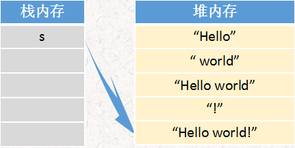
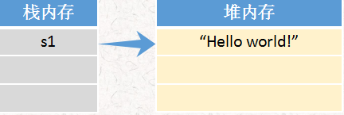
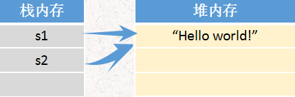
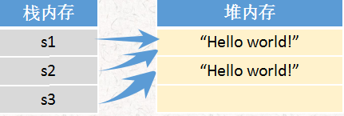
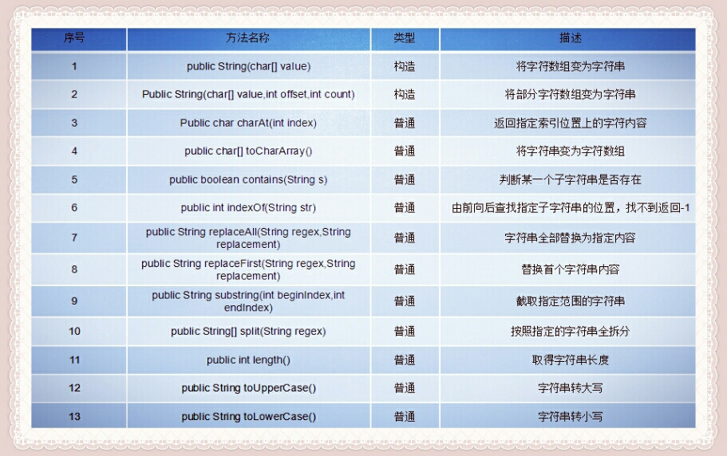

## 1.基本介绍

String类是不可变字符串类，因此用于存放字符串常量。一个String字符串一旦创建，其长度和内容就不能再被改变了。每个String字符串对象创建的时候，就需要指定字符串的内容。

```
String s = "Hello";
s = s + "world";
s = s + "!";
System.out.println(s);//Hello world!
```

从输出结果来看，字符串的内容被改变了，但实际上只是String类对象的引用改变了，开辟出额外的堆内存空间，造成大量字符串垃圾。



所以，在编程过程中应尽量避免多次修改字符串内容，以免出现大量的垃圾。

## 2.特性

1. String类是final的，不可被继承
2. String类的本质是字符数组char[]，并且其值不可改变
3. Java运行时会维护一个String池，String池用来存放运行时产生的各种字符串，并且池中的字符串的内容不重复，而一般对象并不存在这个缓冲池，所创建的对象也仅仅存在于方法的堆栈区

## 3.String的创建方式

1. 使用字符串常量直接初始化

```
String s1 = "Hello World!";
```

这样的字符串严格来讲都是String类的匿名对象，对象名称s1保存在栈内存中，而字符串"Hello World!"保存在堆内存中



通过引用传递创建字符串s2

```
String s2 = s1;
```

在第一次定义字符串的时候，在堆内存中开辟一块空间，如果之后使用直接赋值或者引用传递创建新的对象，且此内容已经存在，就不会开辟新的堆内存，而让其指向了已有的字符串内容。



2.使用构造方法初始化

```
String s3 = new String("Hello World!");
```

这种方法会开辟第二块堆内存空间，其中一块将会成为垃圾，无法实现自动入池操作。



在String类中提供了手工入池的方法：public String intern();

```
String s3 = new String("Hello World!").intern();
```

3.使用串联方式

```
String s4 = “Hello" + "World!";
```

## 4.String的内容比较

1. 调用equals()方法

```
String s = "Hello world!";
Boolean result = s.equals("Hello world!");
```

这个方法在之前已经提到过了，**equals()比较字符串的内容**，它会区分字符串的大小写，也有一种忽略大小写的方法：public boolean equalsIgnorecase();

2.使用比较运算符"=="

```
String s1 = "Hello world!";
String s2 = "Hello world!";
String s3 = new String("Hello world！");
Boolean result1 = (s1==s2);//true
Boolean result2 = (s1==s3);//false
```

可以看出，**“==”完成的是两个对象堆内存地址的判断**，比较两个对象是否引用同一个实例，而不是真正意义上字符串内容的比较

## 5.String类的常用方法

在Java中，String类中定义了大量的操作方法，下面列出了常用的部分方法：

