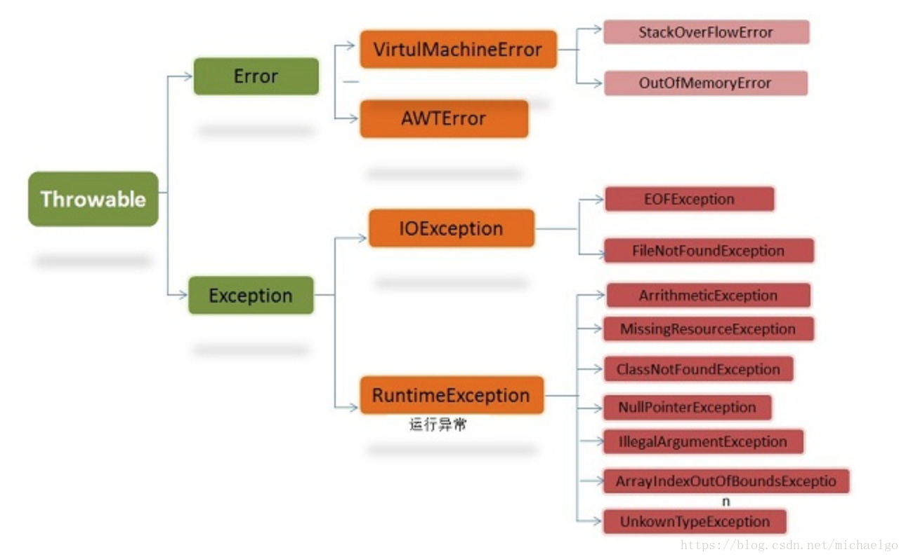

## 1.Java异常类层次结构图



Throwable是所有异常类型的基类，Throwable下一层分为两个分支，Error和Exception

### Error和Exception

- Error

  Error描述了Java程序运行时系统的内部错误，是程序无法处理的错误，通常比较严重，大多数错误与代码编写者执行的操作无关。

  通常为代码运行时JVM出现的问题，如Java虚拟机运行错误（Virtual MachineError），当JVM不再有继续执行操作所需的内存资源时，将出现OutOfMemoryError。这些异常发生时，Java 虚拟机（JVM）一般会选择线程终止。

- Exception

  是程序本身可以处理的异常。

  Exception下面又分为两个分支，一个分支派生自RuntimeException，这种异常通常为程序错误导致的异常，另一个分支为非派生自RuntimeException的异常，这种异常通常是程序本身没有问题，由于像I/O错误等问题导致的异常，每个异常类用逗号隔开。

**注意：异常和错误的区别：异常能被程序本身处理，错误是无法处理。**

### 受查异常和非受查异常

- 受查异常

  受查异常会在编译时被检测，如果一个方法中的代码会抛出受查异常，则该方法必须包含异常处理，即try-catch代码块，或在方法签名中用throws关键字声明该方法可能会抛出受查异常，否则编译无法通过，如果一个方法可能抛出多个受查异常类型，就必须在方法的签名处列出所有的异常类。

- 非受查异常

  非受查异常不会在编译时被检测，Java中Error和RuntimeException类的子类属于非受查异常，除以之外继承自Exception的类型为受查异常。

## 2.Throwable 类常用方法

- **`public string getMessage()`**:获取异常信息，返回字符串
- **`public string toString()`**:获取异常类名和异常信息，返回字符串
- **`public string getLocalizedMessage()`**:返回异常对象的本地化信息。使用 `Throwable` 的子类覆盖这个方法，可以生成本地化信息。如果子类没有覆盖该方法，则该方法返回的信息与 `getMessage（）`返回的结果相同
- **`public void printStackTrace()`**:获取异常类名和异常信息，以及异常出现在程序中的位置，返回值void

```
public class Test {
    public static void main(String[] args) {
        try {
            System.out.println(1/0);
        }catch (Exception e){
            System.out.println(e.getMessage());
            System.out.println(e.toString());
            System.out.println(e.getLocalizedMessage());
            e.printStackTrace();
        }
    }
}
```

输出结果：

```
/ by zero
java.lang.ArithmeticException: / by zero
/ by zero
java.lang.ArithmeticException: / by zero
	at Throwable.Test.main(Test.java:10)
```

## 3.异常处理

代码中的异常处理其实是对受查异常的处理。

### 1.try-catch语句

```
try {
  File file = new File("d:/a.txt");
  if(!file.exists())
    file.createNewFile();
} catch (IOException e) {
  // TODO: handle exception
}
```

被try块包围的代码说明这段代码可能会发生异常，一旦发生异常，异常便会被catch捕获到，然后需要在catch块中进行异常处理

### 2.throws/throw抛出异常

顾名思义，也就是说一旦发生异常，就把这个异常跑出去，让调用者去进行处理，自己不进行具体的处理，此时需要用到throw和throws关键字

```
public class Main {
    public static void main(String[] args) {
        try {
            createFile();
        } catch (Exception e) {
            // TODO: handle exception
        }
    }
     
    public static void createFile() throws IOException{
        File file = new File("d:/a.txt");
        if(!file.exists())
            file.createNewFile();
    }
}
```

这段代码在实际的createFile方法中并没有捕获异常，而是用throws关键字声明抛出异常，即告知这个方法的调用者此方法可能会抛出IOException。那么在main方法中调用createFile方法的时候，采用try...catch块进行了异常捕获处理

当然还可以采用throw关键字手动来抛出异常对象

```
public class Main {
    public static void main(String[] args) {
        try {
            int[] data = new int[]{1,2,3};
            System.out.println(getDataByIndex(-1,data));
        } catch (Exception e) {
            System.out.println(e.getMessage());
        }
         
    }
     
    public static int getDataByIndex(int index,int[] data) {
        if(index<0||index>=data.length)
            throw new ArrayIndexOutOfBoundsException("数组下标越界");
        return data[index];
    }
}
```

**try、catch、finally、throws、throw五个关键字**

- try、catch、finally

  try关键字用来包围可能会出现异常的逻辑代码，它无法单独使用，必须配合catch或者finally使用，Java编译器允许的组合使用形式只有以下三种形式：

  try...catch...;    try....finally......;  try....catch...finally...

  catch块可以有多个，try块只能有一个，finally块是可选的（但是最多只能有一个）

  三个块的执行顺序：try->catch->finally

  当然如果没有发生异常，则catch块不会执行。但是finally块无论在什么情况下都是会执行的（这点要非常注意，因此部分情况下，都会将释放资源的操作放在finally块中进行）。

  在有多个catch块的时候，是按照catch块的先后顺序进行匹配的，一旦异常类型被一个catch块匹配，则不会与后面的catch块进行匹配。

  在使用try..catch..finally块的时候，注意千万不要在finally块中使用return，因为finally中的return会覆盖已有的返回值。

  如下：

  ```
  public class Test {
      public static int f(int value) {
          try {
              return value * value;
          } finally {
              if (value == 2) {
                  return 0;
              }
          }
      }
  }
  ```

  如果调用 `f(2)`，返回值将是 0，因为 finally 语句的返回值覆盖了 try 语句块的返回值。

  

  **在以下4种特殊情况下，finally块不会被执行：**

  1. 在 finally 语句块第一行发生了异常。 因为在其他行，finally 块还是会得到执行
  2. 在前面的代码中用了 System.exit(int)已退出程序。 exit 是带参函数 ；若该语句在异常语句之后，finally 会执行
  3. 程序所在的线程死亡。
  4. 关闭 CPU。

- throw和throws

  1. hrows出现在方法的声明中，表示该方法可能会抛出的异常，然后交给上层调用它的方法程序处理，允许throws后面跟着多个异常类型；
  2. 一般会用于程序出现某种逻辑时程序员主动抛出某种特定类型的异常。throw只会出现在方法体中，当方法在执行过程中遇到异常情况时，将异常信息封装为异常对象，然后throw出去。throw关键字的一个非常重要的作用就是 异常类型的转换

  throws表示出现异常的一种可能性，并不一定会发生这些异常；throw则是抛出了异常，执行throw则一定抛出了某种异常对象。两者都是消极处理异常的方式（这里的消极并不是说这种方式不好），只是抛出或者可能抛出异常，但是不会由方法去处理异常，真正的处理异常由此方法的上层调用处理。

### 3.使用try-with-resources来代替try-catch-finally

- **适用范围（资源的定义）**：任何实现`java.lang.AutoCloseable`或者`java.io.Closeable`的对象
- **关闭资源和final的执行顺序**：在try-with-resources语句中，任何catch或finally块在生命的资源关闭后运行

> 《Effective Java》中明确指出：
>
> 面对必要要关闭的资源，我们总是应该优先使用try-with-resouces而不是try-finally，随之产生的代码更简短，更清晰，产生的异常对我们也更有用。`try-with-resources`语句让我们更容易编写必须要关闭的资源的代码，若采用`try-finally`则几乎做不到这点。

Java 中类似于`InputStream`、`OutputStream` 、`Scanner` 、`PrintWriter`等的资源都需要我们调用`close()`方法来手动关闭，一般情况下我们都是通过`try-catch-finally`语句来实现这个需求，如下：

```
        //读取文本文件的内容
        Scanner scanner = null;
        try {
            scanner = new Scanner(new File("D://read.txt"));
            while (scanner.hasNext()) {
                System.out.println(scanner.nextLine());
            }
        } catch (FileNotFoundException e) {
            e.printStackTrace();
        } finally {
            if (scanner != null) {
                scanner.close();
            }
        }
```

使用Java 7之后的 `try-with-resources` 语句改造上面的代码:

```
try (Scanner scanner = new Scanner(new File("test.txt"))) {
    while (scanner.hasNext()) {
        System.out.println(scanner.nextLine());
    }
} catch (FileNotFoundException fnfe) {
    fnfe.printStackTrace();
}
```

当然多个资源需要关闭的时候，使用 `try-with-resources` 实现起来也非常简单，如果你还是用`try-catch-finally`可能会带来很多问题。

通过使用分号分隔，可以在`try-with-resources`块中声明多个资源。

```
try (BufferedInputStream bin = new BufferedInputStream(new FileInputStream(new File("test.txt")));
             BufferedOutputStream bout = new BufferedOutputStream(new FileOutputStream(new File("out.txt")))) {
            int b;
            while ((b = bin.read()) != -1) {
                bout.write(b);
            }
        } catch (IOException e) {
            e.printStackTrace();
        }
```

## 4.阿里巴巴异常处理规约

1. 【强制】**Java 类库中定义的可以通过预检查方式规避的 RuntimeException 异常不应该通过catch 的方式来处理**，比如：NullPointerException，IndexOutOfBoundsException 等等

   说明：无法通过预检查的异常除外，比如，在解析字符串形式的数字时，可能存在数字格式错误，不得不

   通过 catch NumberFormatException 来实现。

   正例：if (obj != null) {...}

   反例：try { obj.method(); } catch (NullPointerException e) {…}

   

2. 【强制】**异常捕获后不要用来做流程控制，条件控制**

   说明：异常设计的初衷是解决程序运行中的各种意外情况，且异常的处理效率比条件判断方式要低很多。

   

3. 【强制】**catch 时请分清稳定代码和非稳定代码**，稳定代码指的是无论如何不会出错的代码。

   对于非稳定代码的 catch 尽可能进行区分异常类型，再做对应的异常处理。

   说明：对大段代码进行 try-catch，使程序无法根据不同的异常做出正确的应激反应，也不利于定位问题，

   这是一种不负责任的表现。

   正例：用户注册的场景中，如果用户输入非法字符，或用户名称已存在，或用户输入密码过于简单，在程

   序上作出分门别类的判断，并提示给用户。

   

4. 【强制】**捕获异常是为了处理它，不要捕获了却什么都不处理而抛弃之，如果不想处理它，请**

   **将该异常抛给它的调用者**。最外层的业务使用者，必须处理异常，将其转化为用户可以理解的

   内容

   

5. 【强制】**事务场景中，抛出异常被 catch 后，如果需要回滚，一定要注意手动回滚事务**

   

6. 【强制】**finally 块必须对资源对象、流对象进行关闭，有异常也要做 try-catch**

   说明：如果 JDK7 及以上，可以使用 try-with-resources 方式

   

7. 【强制】**不要在 finally 块中使用 return**

   说明：try 块中的 return 语句执行成功后，并不马上返回，而是继续执行 finally 块中的语句，如果此处存

   在 return 语句，则在此直接返回，无情丢弃掉 try 块中的返回点

   反例:

   ```
   private int x = 0;
   
   public int checkReturn() {
   
      try {
   
      // x 等于 1，此处不返回
   
      return ++x;
   
      } finally {
   
        // 返回的结果是 2
   
        return ++x;
   
      } 
   
   }
   ```

   

8. 【强制】**捕获异常与抛异常，必须是完全匹配，或者捕获异常是抛异常的父类**

   

9. 【强制】**在调用 RPC、二方包、或动态生成类的相关方法时，捕捉异常必须使用 Throwable**

   **类来进行拦截**

   

> 参考：
>
> [Java异常处理和设计](https://www.cnblogs.com/dolphin0520/p/3769804.html)
> [JavaGuide](https://github.com/Snailclimb/JavaGuide/blob/master/docs/java/basis/Java%E5%9F%BA%E7%A1%80%E7%9F%A5%E8%AF%86.md#11-java-%E5%85%A5%E9%97%A8%E5%9F%BA%E7%A1%80%E6%A6%82%E5%BF%B5%E4%B8%8E%E5%B8%B8%E8%AF%)
