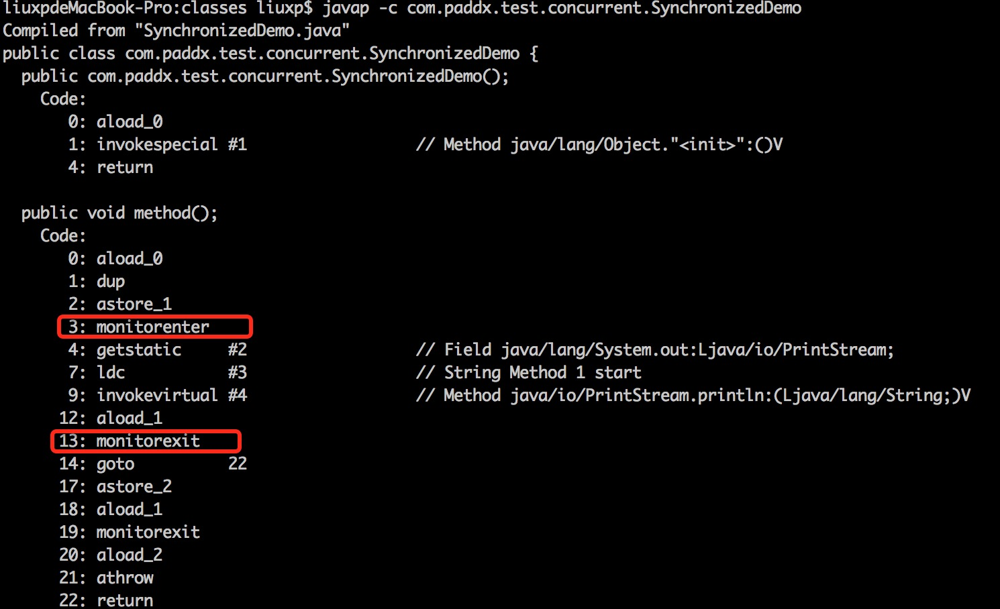

## Java关键字

### final

- final用来修饰类，变量（包括成员变量和局部变量），方法

  - **final修饰的类不能被继承**（如String、StringBuilder、StringBuffer、Math均被final修饰，为不可变类），其中所有的方法都不能被重写，所以不能同时用abstract和final修饰类

    > 为什么设计了继承还要有final来破坏这种继承关系？
    >
    > 《Java编程思想》第四版第143页：
    >
    > ”使用final的原因主要两个，第一个原因是把方法锁定，以防任何继承类改变它的含义，第二个是效率。在早期的Java实现版本中，会将final方法转为内嵌调用，但是如果方法过于庞大，可能看不到内嵌调用带来的任何性能提升了。在最近的Java版本中，不需要使用final方法进行这些优化来了。“

  - **final修饰的方法不能被重写**，（可重载多个final修饰的方法），但是子类可以用父类中final修饰的方法

    > 此处需要注意的一点：
    >
    > 因为重写的前提是子类可以从父类中继承此方法，如果父类中final修饰的方法同时访问权限为private，将会导致子类中不能直接继承到此方法，因此，此时可以在子类中定义相同的方法名和参数，此时不再产生重写与final的矛盾，而是在子类中重新定义了新的方法。（类的private方法会隐式地被指定为final方法）

  - **final修饰的成员变量不可变**

    - 如果成员变量是基本数据类型，初始化之后，成员变量的值不能被改变
    - 如果成员变量是引用类型，那么它只能指向初始化时指向的那个对象，不能再指向别的对象，但是对象中的内容是允许改变的
    - final修饰一个成员变量（属性），必须要显式初始化，这里有两种初始化方式，一种是在遍历声明时初始化，第二种是在声明变量时不赋初值，但是要在这个变量所在类的所有构造函数中对这个变量赋初值

- final关键字的好处：

  - final方法比非final方法快
  - final关键字提高了性能，JVM和Java应用都会缓存变量
  - final变量可以安全的在多线程环境下进行共享，而不需要额外的同步开销
  - 使用final关键字，JVM会对方法、变量及类进行优化

### finally

- **通常和try catch搭配使用，保证不管有没有发生异常，资源都能够被释放**（释放连接，关闭IO流）
- 当try中有return时执行顺序：return语句并不是函数的最终出口，如果有finally语句，这在return之后还会执行finally（return的值会暂存在栈里面，等待finally执行后再返回）
  - 情况一：如果finally中有return语句，则会将try中的return语句“覆盖”掉，直接执行finally中的return语句，得到返回值
  - 情况二：如果finally中没有return语句，也没有改变要返回值，则执行完finally中的语句后，会接着执行try中的return语句，返回之前保留的值
  - 情况三：如果finally中没有return语句，但是改变了要返回的值，这里有点类似引用传递和值传递的区别，分以下两种情况：
    1. 如果return的数据是基本数据类型，则在finally中对该基本数据类型的改变不起作用，try中的return语句依然会返回进入finally块之前保留的值
    2. 如果return的数据是引用数据类型，而在finally中对该引用数据类型的属性值的改变起作用，try中的return语句返回的就是在finally中改变后的该属性的值

> **finalize()：**
>
> 是属于Object类的一个方法，子类可以重写finalize()方法实现对资源的回收。
>
> 该方法一般由垃圾回收器来调用，当我们调用System的gc()方法时，垃圾回收器调用finalize()方法回收垃圾。

参考：https://blog.csdn.net/qq_42651904/article/details/87708198

### static

- 修饰类、方法、变量、代码块

  - **static关键字修饰类**

    一般用来修饰成员变量或函数，但有一种特殊用法是用static修饰内部类，普通类是不允许声明为静态的，只有内部类才可以

  - **static关键字修饰方法**

    修饰方法的时候，跟类一样，可以直接通过类名来调用。

    对于静态方法来说，是没有this和super的，因为它不依附于任何对象。

    静态方法中不能访问类的非静态成员变量和非静态成员方法，因为非静态成员方法/变量都必须依赖具体的对象才能够被调用。非静态成员方法可以访问静态成员方法/变量。

  - **static关键字修饰变量**

    被static修饰的成员变量叫静态变量，说明这个变量是属于类的

    没有被static修饰的成员变量叫实例变量，说明这个变量是属于某个具体的对象的

    

    **静态变量和非静态变量区别**：

    - 静态变量是被所有对象共享，在内存中只有一个副本，它当且仅当在类初次加载时会被初始化。
    - 非静态变量是对象所拥有的，在创建对象的时候被初始化，存在多个副本，各个对象拥有的副本互不影响

  - **static关键字修饰代码块**

    static块可以置于类中的任何地方，类中可以有多个static块。

    在类初次被加载的时候，会按照static块的顺序来依次执行每个static块，并且只会执行一次。

    - **类的初始化顺序：**

      父类静态变量 → 父类静态代码块 → 子类静态变量 → 子类静态代码块 → 父类普通变量 → 父类普通代码块 → 父类构造函数 → 子类普通变量 → 子类普通代码块 → 子类构造函数

    

- static底层分析

  - 静态变量存放在方法区，并且是被所有线程共享的。（实例变量存放在堆上）

### this

- **this关键字用来表示当前对象本身，或当前类的一个实例**，通过this可以调用本对象的所有方法和属性

- **使用this区分同名变量**

  当成员变量与方法内部的变量重名时，可通过this来区分

- **作为方法名来初始化对象**

  调用本类的其他构造方法，但必须在构造方法的第一句

  在一个构造方法内只能调用一个构造方法

- **作为参数传递**

  ```
  public class Demo{
      public static void main(String[] args){
          B b = new B(new A());
      }
  }
  class A{
      public A(){
          new B(this).print();  // 匿名对象
      }
      public void print(){
          System.out.println("Hello from A!");
      }
  }
  class B{
      A a;
      public B(A a){
          this.a = a;
      }
      public void print() {
          a.print();
          System.out.println("Hello from B!");
      }
  }
  ```

  运行结果：

  Hello from A!
  Hello from B!

### super

- **引用直接父类的实例变量**

  如果父类和子类具有相同的字段，则使用super来指定为父类变量

- **调用直接父类的方法**

  如果子类包含与父类相同的方法，则应使用super关键字指定父类的方法

- **调用直接父类构造函数**

### synchronized

#### 作用

synchronized关键字解决的是**多个线程之间访问资源的同步性**，synchronized关键字可以保证被它修饰的方法/代码块在任意时刻只能有一个线程执行，**保证线程安全，解决多线程中的并发同步问题**（实现的是阻塞型并发）

#### 特点

- 保证原子性、可见性和有序性
- 可重入性
- 重量级锁、效率低

#### 使用（类锁、对象锁）

- 修饰代码块

  即同步语句块，其作用的范围是大括号{}括起来的代码，作用的对象是调用这个代码块的对象

- 修饰普通方法

  即同步方法，其作用的范围是整个方法，作用的对象是调用这个方法的对象

- 修饰静态方法

  其作用范围是整个静态方法，作用的对象是这个类的所有对象

#### 原理/底层实现

1. 依赖JVM实现同步
2. 底层通过一个监视器对象（monitor）完成，wait()、notify()等方法也依赖于monitor对象

> 监视器锁（monitor）的本质依赖于底层操作系统的互斥锁（Mutex Lock）实现

具体实现是在编译后再同步方法调用前加入一个monitor.enter指令，在退出方法和异常处插入monitor.exit指令

通过反编译下面的代码来看看synchronized是如何实现对代码块进行同步的：

```
package com.paddx.test.concurrent;

public class Synchronized Demo {
  public void method() {
     synchronized (this) {
        System.out.println("Method 1 start");
     }
  }
}
```

反编译结果：



关于这两条指令的作用：

`monitor enter`

每个对象有一个监视器锁（monitor），当monitor被占用时就会处于锁定状态，线程执行monitor enter指令时尝试获取monitor的所有权，过程如下：

1. 如果monitor的进入数为0，则该线程进入monitor，然后将进入数设置为1，该线程即为monitor的所有者。
2. 如果该线程已经占有该monitor，只是重新进入，则进入monitor的进入数+1
3. 如果其他线程已经占用了monitor，则该线程进入阻塞状态，直到monitor的进入数为0，再重新尝试获取monitor的所有权。

`monitor exit`

执行`monitor exit`的线程必须是object ref所对应的monitor的所有者。

指令执行时，monitor的进入数减1，如果减1后进入数为0，那线程退出monitor，不再是这个monitor的所有者。其他被这个monitor阻塞的线程可以尝试去获取这个monitor的所有权。


Synchronized的语义底层是通过一个monitor的对象来完成，其实wait/notify等方法也依赖于monitor对象，这就是为什么只有在同步的块或者方法中才能调用wait/notify等方法，否则会抛出`java.lang.IllegalMonitorStateException`的异常的原因。


我们再来看一下同步方法的反编译结果：

```
package com.paddx.test.concurrent;

public class SynchronizedMethod {
  public synchronized void method() {
     System.out.println("Hello World!");
  }
}
```

反编译结果：


从反编译的结果来看，方法的同步并没有通过指令monitor enter和monitor exit来完成（理论上也可以通过这两条指令来实现），不过相比于普通方法，其常量池中多了ACC_SYNCHRONIZED标识符。JVM就是根据该标识符来实现方法的同步的：当方法调用时，调用指令将会检查方法的ACC_SYNCHRONIZED访问标志是否被设置，如果设置了，执行线程将先获取monitor，获取成功之后才能执行方法体，方法执行完之后再释放monitor，在方法执行期间，其他任何线程都无法再获得同一个monitor对象。其实本质上没有区别，只是方法的同步时一种隐式的方式来实现，无需通过字节码来完成。

> 参考：https://www.cnblogs.com/paddix/p/5367116.html

#### JVM对synchronized优化

synchronized是一种重量级锁，会涉及到操作系统状态切换影响效率，在JDK1.6中对synchronized进行了各种优化

- 锁膨胀

  锁有四种状态，会因实际情况而进行膨胀升级，其膨胀方向是：**无锁 → 偏向锁 → 轻量级锁 → 重量级锁，方向不可逆**

  1. 偏向锁

     偏向锁是JDK1.6中引用的优化，它的目的是消除数据在无竞争情况下的同步，进一步提高程序的性能。

     在大多数情况下，锁不存在多线程竞争，总是由同一线程多次获得，那么此时就是偏向锁。

     **偏向锁的获取：**

     1. 判断是否为可偏向状态
     2. 如果为可偏向状态，则判断线程ID是否是当前线程，如果是进入同步块
     3. 如果线程ID并未指向当前线程，利用CAS操作竞争锁，如果竞争成功，将Mark Word中线程ID更新为当前线程ID，进入同步块
     4. 如果竞争失败，等待全局安全点，准备撤销偏向锁，根据线程是否处于活动状态，决定是转换为无锁状态还是升级为轻量级锁

     当锁对象第一次被线程获取的时候，虚拟机会把对象头中的标志位设置为“01”，即偏向模式。同时使用CAS操作把获取到这个锁的线程ID记录在对象Mark Word中，如果CAS操作成功。持有偏向锁的线程以后每次进入这个锁相关的同步块时，虚拟机都可以不再进行任何同步操作。

     

     **偏向锁的释放：**

     偏向锁使用了遇到竞争才释放锁的机制。偏向锁的撤销需要等待全局安全点，然后它会首先暂停拥有偏向锁的线程，然后判断线程是否还活着，如果线程还活着，则升级为轻量级锁，否则，将锁设置为无锁状态。

     

  2. 轻量级锁

     轻量级锁是由偏向锁升级而来，也是在JDK1.6中引入的新型锁机制。

     当存在第二个线程申请同一个锁对象时，偏向锁就会立即升级为轻量级锁。注意这里的第二个线程只是申请锁，不存在两个线程同时竞争锁，可以是一前一后地交替执行同步块。

     **加锁过程**：
         在代码进入同步块的时候，如果此对象没有被锁定（锁标志位为“01”状态），虚拟机首先在当前线程的栈帧中建立一个名为锁记录（Lock Record）的空间，用于存储对象目前Mark Word的拷贝（官方把这份拷贝加了一个Displaced前缀，即Displaced Mark Word）。然后虚拟机使用CAS操作尝试将对象的Mark Word更新为指向锁记录（Lock Record）的指针。如果更新成功，那么这个线程就拥有了该对象的锁，并且对象的Mark Word标志位转变为“00”，即表示此对象处于轻量级锁定状态；如果更新失败，虚拟机首先会检查对象的Mark Word是否指向当前线程的栈帧，如果说明当前线程已经拥有了这个对象的锁，那就可以直接进入同步块中执行，否则说明这个锁对象已经被其他线程占有了。如果有两条以上的线程竞争同一个锁，那轻量级锁不再有效，要膨胀为重量级锁，锁标志变为“10”，Mark Word中存储的就是指向重量级锁的指针，而后面等待的线程也要进入阻塞状态。

     

     **解锁过程**：
           如果对象的Mark Word仍然指向线程的锁记录，那就用CAS操作将对象当前的Mark Word与线程栈帧中的Displaced Mark Word交换回来，如果替换成功，整个同步过程就完成了。如果替换失败，说明有其他线程尝试过获取该锁，那就要在释放锁的同时，唤醒被挂起的线程。

     ​     如果没有竞争，轻量级锁使用CAS操作避免了使用互斥量的开销，但如果存在竞争，除了互斥量的开销外，还额外发生了CAS操作，因此在有竞争的情况下，轻量级锁比传统重量级锁开销更大。

  3. 重量级锁

     Synchronized的重量级锁是通过对象内部的一个叫做监视器锁（monitor）来实现的，监视器锁本质又是依赖于底层的操作系统的Mutex Lock（互斥锁）来实现的。而操作系统实现线程之间的切换需要从用户态转换到核心态，这个成本非常高，状态之间的转换需要相对比较长的时间，这就是为什么Synchronized效率低的原因。

- 锁消除

  锁消除是指虚拟机即时编译器（JIT）在运行时，对一些代码上要求同步，但是检测到不可能发生数据竞争的锁进行消除。

- 锁粗化

  如果虚拟机检测到有这样一串零碎的操作都对同一个对象加锁，将会把加锁同步的范围扩展（粗化）到整个操作序列的外部。

- 自旋锁与自适应式自旋锁

  互斥同步对性能影响最大的是阻塞的实现，挂起线程和恢复线程的操作都需要转入到内核态中完成，这些操作给系统的并发性能带来很大的压力。
  于是在阻塞之前，我们让线程执行一个忙循环（自旋），看看持有锁的线程是否释放锁，如果很快释放锁，则没有必要进行阻塞。

> 参考：https://blog.csdn.net/ycllycll/article/details/108724751

### transient

#### 序列化

Java中对象的序列化指的是将对象转换成以字节序列的形式来表示，这些字节序列包含了对象的数据和信息，一个序列化后的对象可以被写到数据库或文件中，也可用于网络传输。

一般地，当我们使用缓存cache（内存空间不够有可能会本地存储到硬盘）或者远程调用RPC（网络传输）的时候，经常需要让实体类实现Serializable接口，目的就是为了让其可序列化。当然，序列化后的最终目的是为了反序列化，恢复成原先的Java对象实例。所以序列化后的字节序列都是可以恢复成Java对象的，这个过程就是可序列化。

#### 为什么要用transient关键字？

在持久化对象时，对于一些特殊的数据成员（如用户的密码，银行卡号等），我们不想用序列化机制来保存它。为了在一个特定对象的一个成员变量上关闭序列化，可以在这个成员变量前加上关键字transient

#### transient作用

- 一旦变量被transient修饰，变量将不再是对象持久化的一部分，该变量内容在序列化后无法被访问
- transient关键字只能修饰变量，而不能修饰方法和类。注意，本地变量是不能被transient关键字修饰的。变量如果是用户自定义类变量，则该类需要实现Serializable接口
- **一个静态变量不管是否被transient修饰，均不能被序列化**(如果反序列化后类中static变量还有值，则值为当前JVM中对应static变量的值)。序列化保存的是对象状态，静态变量保存的是类状态，因此序列化并不保存静态变量

#### 使用场景

- 类中的字段值可以根据其它字段推导出来，如一个长方形类有三个属性长度、宽度、面积，面积不需要序列化。
- 一些安全性的信息，一般情况下是不能离开JVM的。
- 如果类中使用了Logger实例，那么Logger实例也是不需要序列化的

> 参考：https://blog.csdn.net/u012723673/article/details/80699029

### volatile

#### 基本概念

##### 内存模型的相关概念

计算机在执行程序时，每条指令都是在CPU中执行的，而在执行指令过程中，势必涉及到数据的读取和写入。由于程序运行过程中的临时数据是存放在主存（物理内存）当中的，这是就存在一个问题，由于CPU执行速度很快，而从内存读取数据和向内存写入数据的过程跟CPU执行指令的速度比起来要慢得多，因此如果任何时候对数据的操作都要通过和内存的交互来进行，会大大降低指令执行的速度。因此在CPU里面就有了高速缓存。

也就是，当程序在运行过程中，会将运算需要的数据从主存复制一份到CPU的高速缓存当中，那么CPU进行计算时就可以直接从它的高速缓存读取数据和向其中写入数据，当运算结束之后，再将高速缓存中的数据刷新到主存当中。举个简单的例子，比如下面的这段代码：

```
i=i+1
```

当线程执行这个语句时，会先从主存当中读取i的值，然后复制一份到高速缓存当中，然后CPU执行指令对i进行加1操作，然后将数据写入高速缓存，最后将高速缓存中i最新的值刷新到主存当中。

　　这个代码在单线程中运行是没有任何问题的，但是在多线程中运行就会有问题了。在多核CPU中，每条线程可能运行于不同的CPU中，因此每个线程运行时有自己的高速缓存（对单核CPU来说，其实也会出现这种问题，只不过是以线程调度的形式来分别执行的）。我们以多核CPU为例。

　　比如同时有2个线程执行这段代码，假如初始时i的值为0，那么我们希望两个线程执行完之后i的值变为2。但是事实会是这样吗？

　　可能存在下面一种情况：初始时，两个线程分别读取i的值存入各自所在的CPU的高速缓存当中，然后线程1进行加1操作，然后把i的最新值1写入到内存。此时线程2的高速缓存当中i的值还是0，进行加1操作之后，i的值为1，然后线程2把i的值写入内存。

　　最终结果i的值是1，而不是2。这就是著名的**缓存一致性问题**。通常称这种被多个线程访问的变量为共享变量。

　　也就是说，如果一个变量在多个CPU中都存在缓存（一般在多线程编程时才会出现），那么就可能存在缓存不一致的问题。

　　为了解决缓存不一致性问题，通常来说有以下2种解决方法：

　　1**）通过在总线加LOCK#锁的方式**

　　2）**通过缓存一致性协议**

　　这2种方式都是硬件层面上提供的方式。

　　在早期的CPU当中，是通过在总线上加LOCK#锁的形式来解决缓存不一致的问题。因为CPU和其他部件进行通信都是通过总线来进行的，如果对总线加LOCK#锁的话，也就是说阻塞了其他CPU对其他部件访问（如内存），从而使得只能有一个CPU能使用这个变量的内存。比如上面例子中 如果一个线程在执行 i = i +1，如果在执行这段代码的过程中，在总线上发出了LCOK#锁的信号，那么只有等待这段代码完全执行完毕之后，其他CPU才能从变量i所在的内存读取变量，然后进行相应的操作。这样就解决了缓存不一致的问题。

　　但是上面的方式会有一个问题，由于在锁住总线期间，其他CPU无法访问内存，导致效率低下。

　　所以就出现了缓存一致性协议。最出名的就是Intel 的MESI协议，MESI协议保证了每个缓存中使用的共享变量的副本是一致的。它核心的思想是：当CPU写数据时，如果发现操作的变量是共享变量，即在其他CPU中也存在该变量的副本，会发出信号通知其他CPU将该变量的缓存行置为无效状态，因此当其他CPU需要读取这个变量时，发现自己缓存中缓存该变量的缓存行是无效的，那么它就会从内存重新读取。


##### 并发编程中的三个概念：

###### **可见性：**

**可见性，是指线程之间的可见性，一个线程修改的状态对另一个线程是可见的**。也就是一个线程修改的结果，另一个线程马上就能看到。

volatile修饰的变量不允许线程内部缓存和重排序，即直接修改内存，所以对其他线程是可见的。但是这里需要注意一个问题，volatile只能让被他修饰内容具有可见性，但不能保证它具有原子性。比如 volatile int a = 0；之后有一个操作 a++；这个变量a具有可见性，但是a++ 依然是一个非原子操作，也就是这个操作同样存在线程安全问题。

在 Java 中 volatile、synchronized 和 final 实现可见性。

###### **原子性：**

**原子性即一个操作或者多个操作，要么全部执行并且执行的过程不会被任何因素打断，要么就都不执行。**

比如 a=0；（a非long和double类型） 这个操作是不可分割的，那么我们说这个操作时原子操作。再比如：a++； 这个操作实际是a = a + 1；是可分割的，所以他不是一个原子操作。非原子操作都会存在线程安全问题，需要我们使用同步技术（sychronized）来让它变成一个原子操作。一个操作是原子操作，那么我们称它具有原子性。java的concurrent包下提供了一些原子类，我们可以通过阅读API来了解这些原子类的用法。比如：AtomicInteger、AtomicLong、AtomicReference等。

在 Java 中 synchronized 和在 lock、unlock 中操作保证原子性。

###### **有序性：**

**有序性即程序执行的顺序按照代码的先后顺序执行。**

```
int i = 0;
boolean flag = false;
i = 1; //语句1
flag = true; //语句2
```

上面代码定义了一个int型变量，定义了一个boolean型变量，然后分别对两个变量进行赋值操作。从代码顺序上看，语句1是在语句2前面的，那么JVM在真正执行这段代码的时候会保证语句1一定在语句2前面执行吗？不一定，为什么呢？这里可能会发生指令重排序（Instruction Recorder）

**指令重排序**：一般来说，处理器为了提高程序运行效率，可能会对输入代码进行优化，它不保证程序中各个语句的执行先后顺序同代码中的顺序一致，但它会保证程序最终执行结果和代码顺序执行的结果是一致的。

比如上面的代码中，语句1和语句2谁先执行对最终的程序结果并没有影响，那么就有可能在执行过程中，语句2先执行而语句1后执行。

　　但是要注意，虽然处理器会对指令进行重排序，但是它会保证程序最终结果会和代码顺序执行结果相同，那么它靠什么保证的呢？再看下面一个例子：

```
int a = 10;  //语句1
int r = 2;  //语句2
a = a + 3;  //语句3
r = a * a;  //语句4
```

这段代码有4个语句，那么可能的一个执行顺序是：


那么可不可能是这个执行顺序呢： 语句2  语句1  语句4  语句3

不可能，因为处理器在进行重排序时是会考虑指令之间的数据依赖性，如果一个指令Instruction 2必须用到Instruction 1的结果，那么处理器会保证Instruction 1会在Instruction 2之前执行。

虽然重排序不会影响单个线程内程序执行的结果，但是多线程呢？下面看一个例子：

```
//线程1:
context = loadContext();   //语句1
inited = true;             //语句2
 
//线程2:
while(!inited ){
  sleep()
}
doSomethingwithconfig(context);
```

上面代码中，由于语句1和语句2没有数据依赖性，因此可能会被重排序。假如发生了重排序，在线程1执行过程中先执行语句2，而此时线程2会以为初始化工作已经完成，那么就会跳出while循环，去执行doSomethingwithconfig(context)方法，而此时context并没有被初始化，就会导致程序出错。

从上面可以看出，指令重排序不会影响单个线程的执行，但是会影响到线程并发执行的正确性。

也就是说，要想并发程序正确地执行，必须要保证原子性，可见性以及有序性。只要有一个没有被保证，就有可能会导致程序运行不正确。

##### Java内存模型

在Java虚拟机规范中试图定义一种Java内存模型（Java Memory Model，JMM）来屏蔽各个硬件平台和操作系统的内存访问差异，以实现让Java程序在各个平台下都能达到一致的内存访问效果。

那么Java内存模型规定了哪些东西呢，它定义了程序中变量的访问规则，往大一点说是定义了程序执行的次序。注意，为了获得较好的执行性能，Java内存模型并没有限制执行引擎使用处理器的寄存器或者高速缓存来提升指令执行速度，也没有限制编译器对指令进行重排序，也就是说，在Java内存模型中，也会存在缓存一致性问题和指令重排序问题。

Java内存模型规定所有的变量都是存在主存中，每个线程都有自己的工作内存。线程对变量的所有操作都必须在工作内存中进行，而不能直接对主存进行操作，并且每个线程不能访问其他线程的工作内存。

举个简单的例子，在Java中，执行下面这个语句：

```
i = 10;
```

执行线程必须先在自己的工作线程中对变量i所在的缓存进行赋值操作，然后再写入主存当中，而不是直接将数值10写入主存当中。

那么**Java本身对原子性，可见性以及有序性提供了哪些保证呢**？

1. **原子性**

   在Java中，对基本数据类型的变量的读取和赋值操作是原子性操作，即这些操作是不可被中断的，要么执行，要么不执行。

   上面一句话虽然看起来简单，但是理解起来并不是那么容易。看下面一个例子i：

   请分析以下哪些操作是原子性操作：

   ```
   x = 10;         //语句1
   y = x;         //语句2
   x++;           //语句3
   x = x + 1;     //语句4
   ```

   乍一看，有些朋友可能会说上面的4个语句中的操作都是原子性操作。其实只有语句1是原子性操作，其他三个语句都不是原子性操作。

   语句1是直接将数值10赋值给x，也就是说线程执行这个语句的会直接将数值10写入到工作内存中。

   语句2实际上包含2个操作，它先要去读取x的值，再将x的值写入工作内存，虽然读取x的值以及 将x的值写入工作内存 这2个操作都是原子性操作，但是合起来就不是原子性操作了。

   同样的，x++和 x = x+1包括3个操作：读取x的值，进行加1操作，写入新的值。

   所以上面4个语句只有语句1的操作具备原子性。

   　　也就是说，只有简单的读取、赋值（而且必须是将数字赋值给某个变量，变量之间的相互赋值不是原子操作）才是原子操作。

   从上面可以看出，**Java内存模型只保证了基本读取和赋值是原子性操作，如果要实现更大范围操作的原子性，可以通过synchronized和Lock来实现**。由于synchronized和Lock能够保证任一时刻只有一个线程执行该代码块，那么自然就不存在原子性问题了，从而保证了原子性。

2. **可见性**

   对于可见性，Java提供了volatile关键字来保证可见性

   当一个共享变量被volatile修饰时，它会保证修改的值会立即被更新到主存，当有其他线程需要读取时，它会去内存中读取新值。

   而普通的共享变量不能保证可见性，因为普通共享变量被修改之后，什么时候被写入主存是不确定的，当其他线程去读取时，此时内存中可能还是原来的旧值，因此无法保证可见性。

   另外，通过synchronized和Lock也能够保证可见性，synchronized和Lock能保证同一时刻只有一个线程获取锁然后执行同步代码，并且在释放锁之前会将对变量的修改刷新到主存当中。因此可以保证可见性。

3. **有序性**

   在Java内存模型中，允许编译器和处理器对指令进行重排序，但是重排序过程不会影响到单线程程序的执行，却会影响到多线程并发执行的正确性。

   在Java里面，可以通过volatile关键字来保证一定的“有序性”。另外可以通过synchronized和Lock来保证有序性，很显然，synchronized和Lock保证每个时刻是有一个线程执行同步代码，相当于是让线程顺序执行同步代码，自然就保证了有序性。

   另外，Java内存模型具备一些先天的“有序性”，即不需要通过任何手段就能够得到保证的有序性，这个通常也称为happens-before原则。如果两个操作的执行次序无法从happens-before原则推导出，那么它们就不能保证它们的有序性，虚拟机可以随意地对它们进行重排序。

   下面就来具体介绍一下**happens-before原则（先行发生原则）**：

   - 程序次序规则：一个线程内，按照代码顺序，书写在前面的操作先行发生于书写在后面的操作
   - 锁定规则：一个unlock操作先行发生于后面对同一个锁的lock操作
   - volatile变量规则：对一个变量的写操作先行发生于后面对这个变量的读操作
   - 传递规则：如果操作A先行发生于B操作，而操作B又先行发生于操作C，则可以得出操作A先行发生于操作C
   - 线程启动规则：Thread对象的start()方法先行于此线程的每一个动作
   - 线程中断规则：对线程interrupt()方法的调用先行发生于被中断线程的代码检测到中断事件的发生
   - 线程终结规则：线程中所有的操作都先行发生于线程的终止检测，我们可以通过Thread.join()方法结束、Thread.isAlive()的返回值手段检测到线程已经终止执行
   - 对象终结规则：一个对象的初始化完成先行发生于他的finalize()方法的开始

   这八条原则摘自《深入理解Java虚拟机》

   这8条规则中，前4条规则是比较重要的，后4条规则都是显而易见的。

   下面我们来解释一下前4条规则：

   　　对于**程序次序规则**来说，我的理解就是一段程序代码的执行在单个线程中看起来是有序的。注意，虽然这条规则中提到“书写在前面的操作先行发生于书写在后面的操作”，这个应该是程序看起来执行的顺序是按照代码顺序执行的，因为虚拟机可能会对程序代码进行指令重序。虽然进行重排序，但是最终执行的结果是与程序顺序执行的结果一致的，它只会对不存在数据依赖性的指令进行重排序。因此，在单个线程中，程序执行看起来是有序执行的，这一点要注意理解。事实上，这个规则是用来保证程序在单线程中执行结果的正确性，但无法保证程序在多线程中执行的正确性。

   　　第二条规则也比较容易理解，也就是说无论在单线程中还是多线程中，同一个锁如果处于被锁定的状态，那么必须先对锁进行了释放操作，后面才能继续进行lock操作。

   　　第三条规则是一条比较重要的规则，直观地解释就是，如果一个线程先去写一个变量，然后一个线程去进行读取，那么写入操作肯定会先行发生于读操作。

   　　第四条规则实际上就是体现happens-before原则具备传递性。

#### 原理：

把变量声明为volatile类型后，编译器与运行时都会注意到这个变量是共享的，因此不会将该变量上的操作与其他内存操作一起重排序。volatile变量不会被缓存在寄存器或者对其他处理器不可见的地方，因此在读取volatile类型的变量时总会返回最新写入的值。

**在访问volatile变量时不会执行加锁操作，因此也就不会执行线程阻塞，因此volatile变量是一种比synchronized关键字更轻量级的同步机制。**


当对非volatile变量进行读写的时候，每个线程先从内存拷贝变量到CPU缓存中。如果计算机有多个CPU，每个线程可能在不同的CPU上被处理，这意味着每个线程可以拷贝到不同的CPU cache中。

**而声明变量是volatile的，JVM保证了每次读变量都从内存中读，跳过CPU cache这一步。**

当一个变量定义为volatile之后，将具备两种特性：

1. 保证此变量对所有线程的可见性，这里的可见性，当一个线程修改了这个变量的值，volatile保证了新值能立即同步到主内存，以及每次使用前立即从主内存刷新。但普通变量做不到这点，普通变量的值在线程间传递均需要通过主内存来完成。

2. 禁止指令重排序优化。有volatile修饰的变量，赋值后多执行了一个“load addl $0x0, (%esp)”操作，这个操作相当于一个**内存屏障**（指令重排序时不能把后面的指令重排序到内存屏障之前的位置），只有一个CPU访问内存时，并不需要内存屏障。

   > 下面这段话摘自《深入理解Java虚拟机》：
   >
   > “观察加入volatile关键字和没有加入volatile关键字时所生成的汇编代码发现，加入volatile关键字时，会多出一个lock前缀指令”
   >
   > lock前缀指令实际上相当于一个内存屏障（也称内存栅栏），内存屏障会提供3个功能：
   >
   > 1. 确保指令重排序时不会把其后面的指令排到内存屏障之前的位置，也不会把前面的指令排到内存屏障的后面，即在执行到内存屏障这句指令时，在它前面的操作已经全部完成
   > 2. 强制将对缓存的修改操作立即写入主存
   > 3. 如果是写操作，它会导致其他CPU中对应的缓存行无效

**volatile性能：**

volatile的读性能消耗与普通变量几乎相同，但是写操作稍慢，因为它需要在本地代码中插入许多内存屏障指令来保证处理器不发生乱序执行。

#### 使用场景：

synchronized关键字是防止多个线程同时执行一段代码，那么就会很影响程序执行效率，而volatile关键字在某些情况下性能要优于synchronized，但是要注意volatile关键字是无法替代synchronized关键字的，因为volatile关键字无法保证操作的原子性。通常来说，使用volatile必须具备以下2个条件：

　　1）对变量的写操作不依赖于当前值

　　2）该变量没有包含在具有其他变量的不变式中

　　实际上，这些条件表明，可以被写入 volatile 变量的这些有效值独立于任何程序的状态，包括变量的当前状态。

　　事实上，我的理解就是上面的2个条件需要保证操作是原子性操作，才能保证使用volatile关键字的程序在并发时能够正确执行。

　　下面列举几个Java中使用volatile的几个场景。

1. ##### 状态标记量

   ```
   volatile boolean flag = false;
    
   while(!flag){
       doSomething();
   }
    
   public void setFlag() {
       flag = true;
   }
   ```

   ```
   volatile boolean inited = false;
   //线程1:
   context = loadContext();  
   inited = true;            
    
   //线程2:
   while(!inited ){
   sleep()
   }
   doSomethingwithconfig(context);
   ```

2. ##### double check

   ```
   class Singleton{
       private volatile static Singleton instance = null;
        
       private Singleton() {
            
       }
        
       public static Singleton getInstance() { //1
           if(instance==null) { //2
               synchronized (Singleton.class) { //3
                   if(instance==null) //4
                       instance = new Singleton();  //5
               }
           }
           return instance;
       }
   }
   ```

   需要volatile关键字的原因是，在并发情况下，如果没有volatile关键字，在第5行会出现问题。

   instance = new Singleton(); 可以分解为3行伪代码

   a.memory = allocate() //分配内存

   b. ctorInstanc(memory) //初始化对象

   c. instance = memory //设置instance指向刚分配的地址

   上面的代码在编译运行时，可能会出现重排序从a-b-c排序a-c-b，在多线程情况下会出现以下问题，当线程A在执行第5行代码时，线程B进来执行到第2行代码，假设此时A执行的过程中发生了指令重排序，即先执行了a和c，没有执行b，那么由于线程A执行了c导致instance指向了一段地址，所以线程B判断instance不为null，会直接跳到第6行并返回一个未初始化对象。

> 参考：  
> [Java中Volatile关键字详解](https://www.cnblogs.com/zhengbin/p/5654805.html)   
> [Java并发编程：volatile关键字解析](https://www.cnblogs.com/dolphin0520/p/3920373.html)   
> [Java volatile关键字最全总结]( https://blog.csdn.net/u012723673/article/details/80682208#%E5%85%AB%E3%80%81%E5%8D%95%E4%BE%8B%E6%A8%A1%E5%BC%8F%E7%9A%84%E5%8F%8C%E9%87%8D%E9%94%81%E4%B8%BA%E4%BB%80%E4%B9%88%E8%A6%81%E5%8A%A0volatile)
